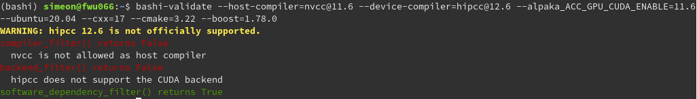

# ⚠️ Disclaimer ⚠️

This project will be the successor to the [alpaka-job-matrix-library](https://github.com/alpaka-group/alpaka-job-matrix-library). We have decided that several fundamental changes are needed in the [alpaka-job-matrix-library](https://github.com/alpaka-group/alpaka-job-matrix-library), including renaming. Therefore, rewriting large parts of the code base would be necessary. Based on this, we have decided that a new project means less work. Until this project is officially released, please use the [alpaka-job-matrix-library](https://github.com/alpaka-group/alpaka-job-matrix-library). The project is already public due to the use of CI features.

# bashi

[](https://codecov.io/github/alpaka-group/bashi)

A library to provide a job generator for CI's for alpaka based projects.

The library provides everything needed to generate a sparse combination matrix for [alpaka](https://github.com/alpaka-group/alpaka)-based projects, including a set of general-purpose combination rules.

The main function of the library is `generate_combination_list()`. It takes a list of `parameter-values`, creates the `combination-list`, applies the combination filter rules, thins it out and returns the sparse `combination-list`.

The thinning is done according to the principle [all-pairs testing](https://en.wikipedia.org/wiki/All-pairs_testing). The principle means that every combination of the `parameter-values` of at least two `parameters` must be part of a `combination`, unless a filter rule forbids this.

The provision of the input `parameters-values`, adding custom filter rules, the reordering of the jobs, the filtering of the `combination-list` and the generation of the job yaml are project specific. Therefore, the library provides an [example](example/example.py) of how most parts can be implemented.

# Naming

The main component of the `bashi` library is combinatorics. Due to the wide spread of the field, there are different words for the same things. Therefore, `bashi` has introduced a naming guideline that is used for function and parameter names and documentation. Please read the [naming guidelines](docs/naming.md).

# Example

An example of the use of the `bashi` library can be found in [example/example.py](example/example.py). It shows how to use the library to create a `combination-list` from a `parameter-value-matrix`. The example also uses a custom filter. For more details, please read the module documentation of [example/example.py](example/example.py).

# Installation

⚠️ Disclaimer ⚠️ Not working yet -> needs to be registered.

Install via pip:

```bash
pip install bashi
```

See [pypi.org](https://pypi.org/project/bashi/)

# bashi-validate

`bashi-validate` is a tool which is installed together with the `bashi` library. The tool allows to check whether a combination of parameters passes the different filters and displays the reason if not.



**Hint:** The source code of the tool is located in the file [validate.py](src/bashiValidate/validate.py).


# Developing

It is strongly recommended to use a Python environment for developing the code, such as `virtualenv` or a `conda` environment. The following code uses a `virtualenv`.

1. Create the environment: `virtualenv -p python3 env`
2. Activate the environment: `source env/bin/activate`
3. Install the library: `pip install --editable .`
4. Test the installation with the example: `python3 example/example.py`
5. You can run the unit tests by going to the `test` directory and running `python -m unittest discover -s tests -p "*.py"`

If the example works correctly, a `job.yml` will be created in the current directory. You can also run `python3 example/example.py --help` to see additional options.

Now the library is available in the environment. Therefore you can easily use the library in your own projects via `import bashi`.

## Contribution

This section contains some hints for developing new functions. The hints are mainly for people who have no experience with `setuptools` and building `pip` packages.

* The `pip install --editable .` command installs the source code files as a symbolic link. This means that changes in the source code of the Python files in the `src/bashi` folder are directly available without any additional installation step (only a restart of the Python process/interpreter is required).
* The software requirements are defined in `pyproject.toml` and not in an additional `requirements.txt`.
* It is necessary to increase the version number in `version.txt` before a new feature can be merged in the master branch. Otherwise the upload to pypy.org will fail because existing versions cannot be changed.

## Writing a new Filter rule

Writing a new filter rule can be complicated. That's why we offer a [best practice guide](docs/rules.md).

## Removing expected parameter-values

`bashi` offers the option of checking the generated combination-list for expected and unexpected parameter-value-pairs. To do this, `bashi` first generates all possible parameter-value-pairs from the input parameter-values and then removes unexpected parameter-values. `bashi` supports common cases of removing parameter-value-pairs with some util functions. Read the [guide for removing parameter-value-pairs](./docs/remove-parameter-value-pairs.md) for more information about util functions.

## Formatting the Source Code

The source code is formatted using the [black](https://pypi.org/project/black/) formatter and the default style guide. You must install it and run `black /path/to/file` to format a file. A CI job checks that all files are formatted correctly. If the job fails, a PR cannot be merged.

## Check Code Coverage locally

The project supports code coverage with [coverage.py](https://coverage.readthedocs.io). To create a coverage report locally, you must first install the package via `pip install coverage`. Then run `coverage run` in the project folder to calculate the coverage and `coverage report` to display the result.

# What is a Bashi?

Bashi is short for caravan bashi, which is the English translation of the Turkish word  `kervanbaşı/karavanbaşı`, head of the caravan.
